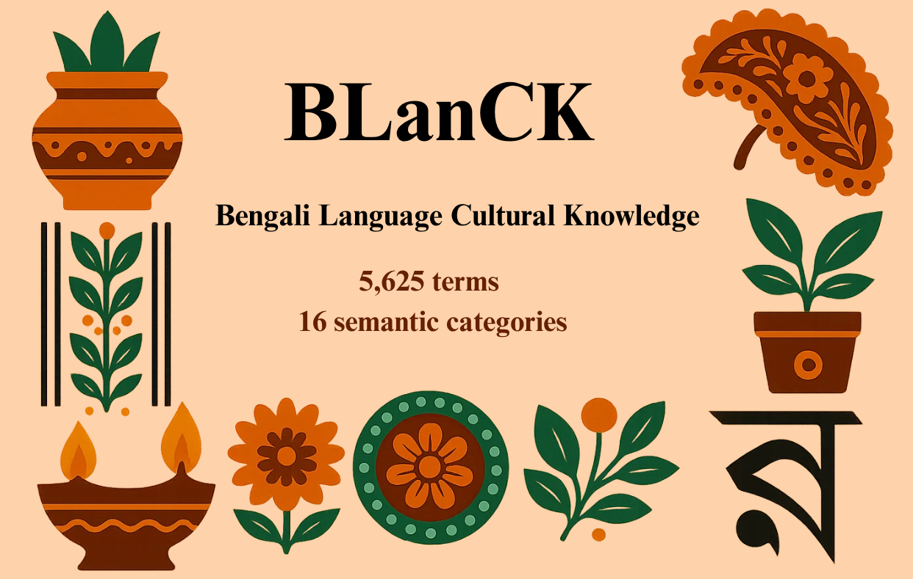

# BLanCK: Bengali Language Cultural Knowledge

This repository provides the dataset and prompts to evaluate Large Language Models (LLMs) on Bengali cultural knowledge.

## Dataset

The `dataset` folder contains two sets tailored for different NLP tasks:

- **Question Answering**: This dataset includes Bengali terms along with corresponding questions, contextual passages, the popularity of each term, and their respective category and culture type.

- **Masked Prediction**: This dataset features Bengali terms with context, masked sentences for language modeling, and includes their respective category and culture type.

Each version contains Bengali terms along with their contexts sourced from Wikipedia. The dataset is comprised of:

- Cultural categories (44.39%)  
- Non-cultural categories (42.6%)  
- Miscellaneous (13.01%)

## Prompts

The `prompts` folder contains two separate code sections for:

- **Question Answering**
- **Masked Prediction**

Each section includes scripts to run specific models on the BLanCK dataset.

The following models were used in our evaluation:

- **Gemini 2.0 Flash**
- **DeepSeek-V3 0324**
- **LLaMA 3 (70B, 8192)**
- **GPT-4o**
- **Mistral Small 3.1**
- **Mistral Saba**

These scripts allow easy integration with the dataset and help benchmark LLMs across cultural and non-cultural knowledge tasks in Bengali.
